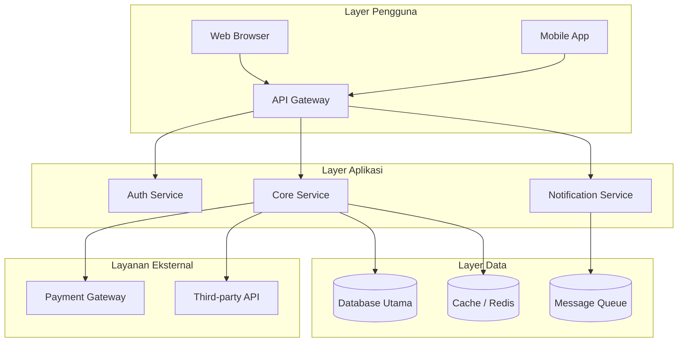

# Arsitektur Teknis: [Nama Epic]

> Dokumen ini adalah spesifikasi arsitektur teknis tingkat tinggi untuk epic **[Nama Epic]**.
> Dibuat berdasarkan Epic PRD: `docs/plan/{nama-epic}/epic.md`

---

## A1. Ringkasan Arsitektur

[Paragraf singkat tentang pendekatan teknis keseluruhan untuk epic ini. Apa pola arsitektur yang digunakan? Apa filosofi desainnya?]

---

## A2. Diagram Arsitektur Sistem

*Buat diagram Mermaid yang menggambarkan arsitektur lengkap. Sesuaikan dengan tech stack aktual proyek.*

*Sesuaikan diagram dengan komponen aktual. Gunakan subgraph untuk mengelompokkan layer.*

---

## A3. Fitur & Technical Enablers

### Fitur Tingkat Tinggi yang Dibangun

| # | Fitur | Deskripsi Singkat | Prioritas |
|---|---|---|---|
| F-001 | [Nama Fitur] | [Apa yang dilakukan] | `Wajib` |
| F-002 | [Nama Fitur] | [Apa yang dilakukan] | `Sebaiknya` |

### Technical Enablers
*(Infrastruktur, library, atau service baru yang dibutuhkan — belum ada sekarang)*

| # | Enabler | Tipe | Alasan Dibutuhkan |
|---|---|---|---|
| TE-001 | [Nama] | Service baru / Library / Infrastruktur | [Mengapa diperlukan] |
| TE-002 | [Nama] | | |

---

## A4. Tech Stack

| Layer | Teknologi | Versi / Detail | Keterangan |
|---|---|---|---|
| Frontend | [Framework] | [Versi] | |
| Backend | [Framework/Language] | [Versi] | |
| Database | [DB] | [Versi] | |
| Cache | [Tool] | [Versi] | |
| Queue | [Tool] | [Versi] | |
| Auth | [Service] | | |
| Deployment | [Platform/Container] | | |
| Monitoring | [Tool] | | |

---

## A5. Nilai Teknis

`Tinggi` / `Sedang` / `Rendah`

**Justifikasi:** [Mengapa estimasi ini? Pertimbangkan: kompleksitas teknis, risiko, ketergantungan, dampak pada sistem lain.]

### Pertimbangan Teknis Utama
- [Keputusan arsitektur penting 1 — mengapa dipilih]
- [Keputusan arsitektur penting 2 — mengapa dipilih]
- [Constraint teknis yang mempengaruhi desain]

### Risiko Teknis

| Risiko | Dampak | Mitigasi |
|---|---|---|
| [Risiko teknis 1] | Tinggi/Sedang/Rendah | [Cara mitigasi] |
| [Risiko teknis 2] | | |

---

## A6. Estimasi Ukuran (T-Shirt Size)

### Keseluruhan Epic
`S` / `M` / `L` / `XL`

### Per Fitur

| Fitur | Ukuran | Asumsi |
|---|---|---|
| [Nama Fitur 1] | `M` | [Asumsi yang mendasari estimasi] |
| [Nama Fitur 2] | `L` | [Asumsi yang mendasari estimasi] |

**Catatan Estimasi:**
- S = < 2 sprint
- M = 2–4 sprint
- L = 4–8 sprint
- XL = > 8 sprint atau perlu dipecah

---

## A7. Keputusan Arsitektur yang Ditolak

*(Selalu sertakan minimal satu — menunjukkan trade-off yang sudah dipikirkan)*

| Opsi | Deskripsi | Alasan Ditolak |
|---|---|---|
| Opsi A | [Deskripsi] | [Alasan] |
| Opsi B | [Deskripsi] | [Alasan] |

---

*— Arsitektur Teknis Template — prd-epic-indonesia skill —*
